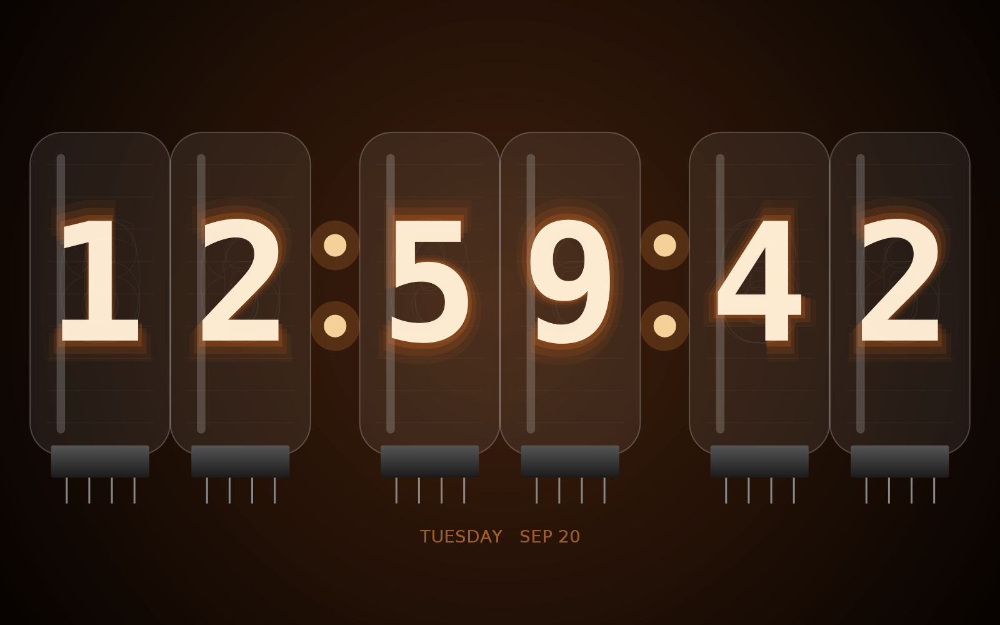

# Nixie Wall Clock

A landscape, always-on, full-screen Android clock styled after a Nixie tube
display: six glowing amber glass tubes (HH:MM:SS) with faint "unlit" ghost
numerals behind the lit digit, a wire mesh anode, and a metal base/pins
under each tube — meant to turn a spare **Fire HD 8 (7th Gen)** into a wall
clock.



Earlier iterations recreated a Casio A-158W watch case, then a plain
seven-segment LCD face; both are still in git history
(`git log --oneline -- casio-a158w-clock`) if you'd rather use one of
those, but this Nixie look isn't Casio-inspired at all and is the current
default.

## What it does

- Draws the face with Canvas (no images): each tube's glass, mesh, glow,
  and glyph outline is vector geometry, sized dynamically to the actual
  screen so it fills the display edge-to-edge on any resolution.
- The glowing digit is the real numeral outline (via `Paint.getTextPath`),
  not a seven-segment font — drawn several times at increasing scale and
  decreasing opacity for the glow halo, plus faint stroked "ghost" numerals
  behind it to suggest the other unlit wire digits stacked in the tube.
- Updates every second, aligned to the system clock.
- Keeps the screen on and hides the status/navigation bars for a clean,
  kiosk-like look.
- Tap the screen to toggle 12h/24h (the choice is remembered; the hour
  tube just goes unlit for a suppressed leading zero in 12h mode).
- Relaunches itself automatically after the tablet reboots (handy for a
  wall-mounted device that loses power occasionally).
- Can optionally be set as the tablet's Home app, so pressing Home always
  returns to the clock.

## Building the APK

This device (Fire OS 5.6.4 on the 7th-gen Fire HD 8) predates most modern
build tooling, but the app itself just needs a normal Android toolchain:

1. Install [Android Studio](https://developer.android.com/studio) (or just
   the command-line SDK tools + a JDK 17).
2. Open the `casio-a158w-clock/` folder as a project (Android Studio will
   fetch the Android Gradle Plugin and SDK platform automatically).
3. Build → Generate Signed Bundle/APK → APK (or just run
   `./gradlew assembleDebug` from a terminal with `ANDROID_HOME` set).
4. The APK lands at `app/build/outputs/apk/debug/app-debug.apk`.

> This sandbox could reach `services.gradle.org` but not Google's Maven
> repository (`dl.google.com`), so the Android Gradle Plugin couldn't be
> downloaded here to produce a signed APK directly. Everything else
> (Gradle wrapper, all source, resources) is in place — building just
> needs to happen somewhere with normal internet access, e.g. your own
> machine or Android Studio. The digit glow/layout math was validated in a
> standalone Java prototype (see the preview image) before being ported to
> Android's `Canvas`/`Paint`, but I couldn't compile or run the actual APK
> here — give the clock a look once it's built, in case the `Typeface.MONOSPACE`
> fallback renders the numerals a bit differently than the preview.

## Installing on the Fire HD 8

Fire OS doesn't ship the Play Store, so you sideload the APK:

1. On the tablet: **Settings → Security & Privacy → Apps from Unknown
   Sources** (or "Install unknown apps" for the app you'll use to install
   it, e.g. Silk Browser or a file manager) → allow it.
2. Easiest path — ADB over USB or Wi-Fi:
   ```
   adb connect <tablet-ip>:5555   # if using Wi-Fi debugging
   adb install -r app-debug.apk
   ```
   (Enable ADB debugging first: **Settings → Device Options → tap "Serial
   Number" 7 times** to unlock Developer Options, then **Developer
   Options → ADB Debugging**.)
3. Or copy the APK to the tablet (USB file transfer, email, cloud drive)
   and open it with a file manager to install.

## Setting it up as a wall clock

1. Launch the clock app once from the app drawer.
2. Go to **Settings → Display → Sleep** and set it to the longest option
   (or "Never", if available) — `FLAG_KEEP_SCREEN_ON` keeps the screen on
   while the app is in the foreground, but the tablet can still lock itself
   if you switch away from it.
3. Optional but recommended for a dedicated wall clock: long-press Home,
   or go to **Settings → Apps → Choose Home App**, and pick this app as the
   default Home/launcher. That way the clock survives an accidental Home
   press, and (combined with the boot receiver) the tablet comes back up
   showing the clock after any power cycle.
4. Mount the tablet in landscape orientation — the app locks to landscape.

## Project layout

```
casio-a158w-clock/
  app/src/main/java/com/skharma/casioclock/
    MainActivity.kt          full-screen host: keep-awake, immersive mode, tap-to-toggle 12/24h
    NixieClockView.kt        all the drawing: glass tubes, glow/ghost digits, mesh anode, base/pins
    BootReceiver.kt          relaunches the clock after a reboot
  app/src/main/res/          strings, colors, theme, launcher icon
```
